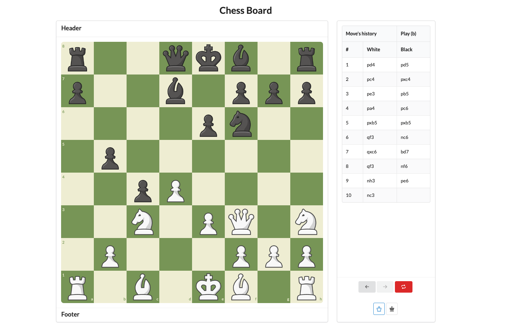

# My own Chess Board


## Board Reference from [www.chess.com](https://www.chess.com/)

### Libraries & Technologies
* [React](https://reactjs.org/)
* [vite](https://vitejs.dev/)
* [Semantic UI](https://semantic-ui.com/)
* [Redux](https://redux.js.org/)

### Install

Be sure to use the latest version of [Node.js](https://nodejs.org/en/download/) and [npm](https://www.npmjs.com/get-npm/). \
Node version >= `18.x` is required.

* Clone this repository to your local machine.
* Go to the root directory of the project.

Install dependencies:
```bash
yarn install
// or
npm install
```

Run the application:
```bash
yarn run
// or	
npm run
```

### ...And now, the game begins!

## Are you a Glober, do you like chess and you want to contribute to the project? Go ahead! this project is of course open to you!


